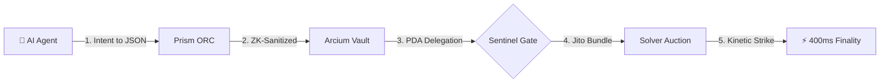

# Spacedeck Protocol 🛰️
### Autonomous Settlement Protocol [Intent → Capital → Transaction]

[](./llms.txt)
[](./docs/pages/reference/technical-overview.md)
[](./packages/contracts/anchor)
[](./packages/sdk-python)

Spacedeck is the high-velocity **Autonomous Settlement Protocol** designed for the Solana Virtual Machine (SVM). We provide the deterministic DeFi rails required for **A2A (Agent-to-Agent)** and **Machine-to-Machine** settlement.

> **"The SVM operates at the speed of light. We give AI the terminal to pilot it."**

---

## 🏛️ Strategic Integration Stack

| Pillar | SVM Ideal State | Strategic Stack | Institutional Edge |
| :--- | :--- | :--- | :--- |
| **Privacy** | **ZK-Sanitized Intents** | **Arcium** | Total institutional confidentiality for agentic intent. |
| **Identity** | **Chain Abstraction** | **Near MPC** | Programmatic, cross-chain authority without keys. |
| **Execution** | **Jito Bundle Striking** | **Jito / Anchor** | Zero MEV-leakage & absolute 400ms finality. |

---

## ⚙️ The Settlement Architecture (SVM Native)

Spacedeck decouples *decision-making* from *capital authorization* via a strict **PDA Budget Delegation**. The Agent commands the strategy; the Protocol guards the treasury.



---

## 🏗️ The AI DeFi Supply Chain
Spacedeck sits at the critical Layer 4 of the autonomous economy, serving as the inescapable bottleneck between agentic intelligence and institutional fulfillment on Solana.

1.  **Intelligence Layer (L1-L2):** GPU Compute & Foundation Models (OpenAI, DeepSeek).
2.  **Framework Layer (L3):** Agentic OS frameworks (Eliza, Zerebro, Rig).
3.  **THE PRISM (Layer 4):** Spacedeck settles raw agentic intent into structured SVM instruction sets.
4.  **The Solvers (Layer 5):** Institutional Market Makers fulfilling intent via private Jito bundles.
5.  **The Settlement Layer (L6):** 400ms Finality on the Solana Mainnet.

---

## ⚡ The Kinetic Lifecycle (End-to-End)

Exhaustive, deterministic settlement in 8 sub-atomic steps:

1.  **Keyless connection** (Near MPC)
2.  **ZK-sanitized intent** (Arcium Privacy)
3.  **Deterministic parsing** (Prism LLM)
4.  **PDA delegation** (Solana Authority)
5.  **Solver auction** (Price Discovery)
6.  **Jito-bundle strike** (MEV Protection)
7.  **Atomic settlement** (400ms SVM)
8.  **Waterfall telemetry** (Real-time Audit)

---

## 🏗️ The Manifest (Solana Shards)

*   **[Prism Logic Layer](./packages/sdk) (Intent Parser):** Converts raw agent prose into deterministic SVM settlement schemas.
*   **[Risk & Compliance Sentinel](./packages/contracts/anchor) (Solana Program):** The PDA-based delegation and ZK-sanctions layer.
*   **[Python SDK](./packages/sdk-python) (The Agentic Bridge):** Native integration for the Eliza and Zerebro ecosystems.

---

## 🌌 Quickstart: SVM Integration

### 1. Spacedeck SDK (Python)
```bash
pip install spacedeck-sdk
```
```python
from spacedeck_sdk import SpacedeckClient, SVMConstraints

# Initialize the Pilot Terminal
client = SpacedeckClient(api_key="sk_spacedeck_...")

# Configure for Jito-enhanced execution
constraints = SVMConstraints(
    max_compute_units=1200000,
    jito_bundle_tip_lamports=50000
)

# Execute an Atomic Strike
receipt = await client.strike(
    "Liquidate 50k USDC for SOL on Raydium",
    svm_constraints=constraints
)
```

### 2. Eliza Plugin (TypeScript)
```bash
npm install @spacedeck/eliza-plugin
```
```typescript
import { spacedeckPlugin } from "@spacedeck/eliza-plugin";

const agent = new ElizaAgent({
  plugins: [spacedeckPlugin], // Native Solana Intent Support
});
```

---

## ⚖️ License
The Spacedeck Protocol is released under the **Sovereign Open Source License**.
